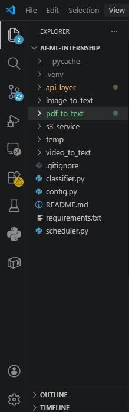
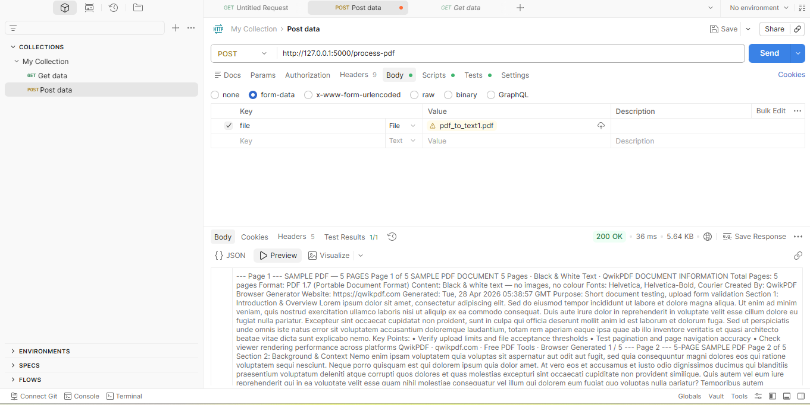
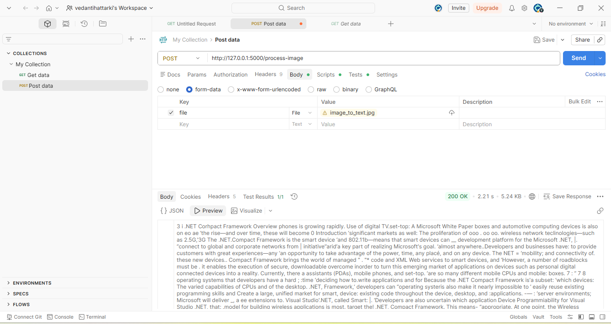
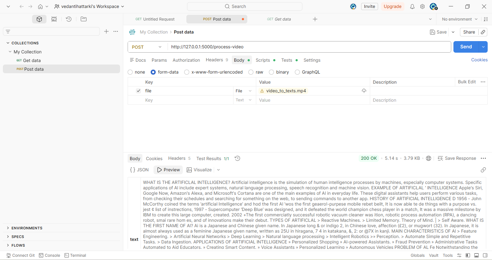
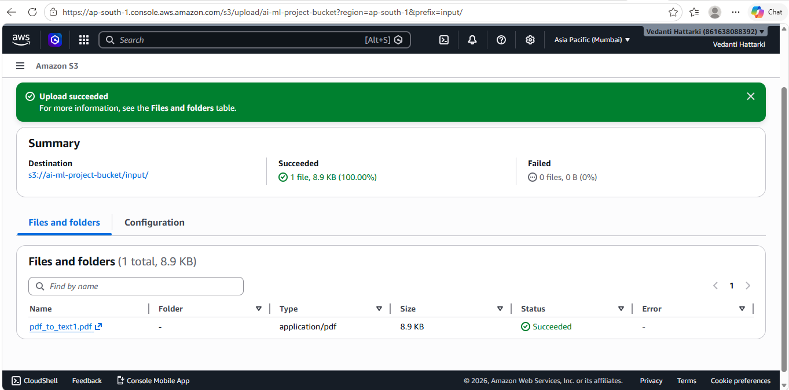
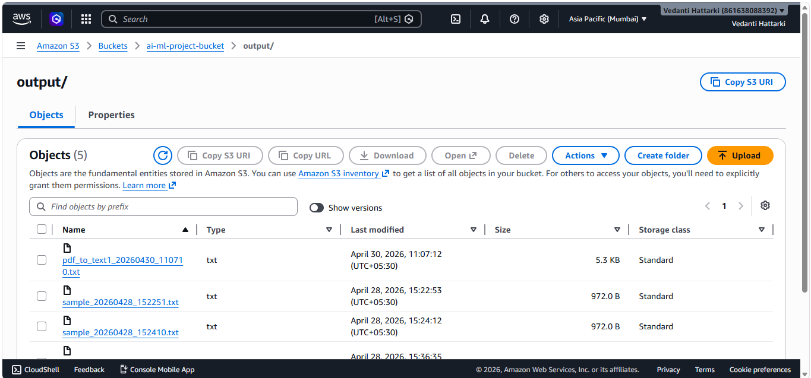
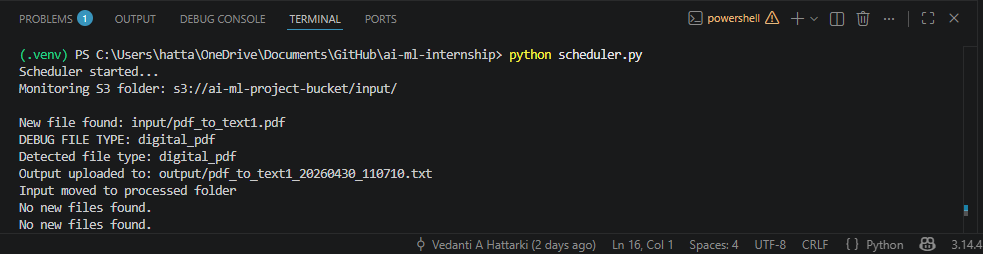
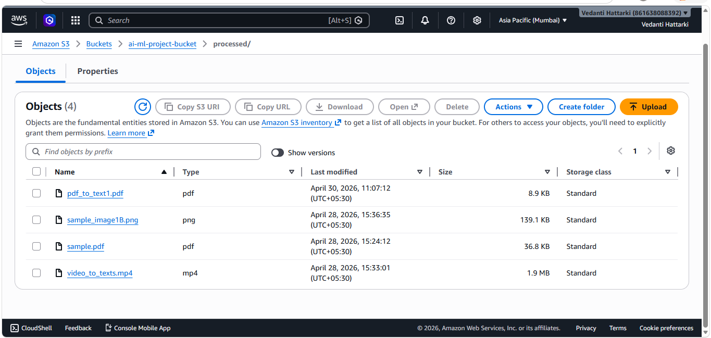

# AI-ML Internship Project 

##  Overview

This project is an end-to-end **OCR (Optical Character Recognition) Automation System** that processes **PDFs, Images, and Videos** to extract text.

The system is designed using:

* **Flask APIs** is an API built using Flask(a Python Framework) that allows users or systems to send and get responses over the internet.In this project it is used for exposing the functionalities using REST(**Representational State Transfer** - A standard way of communicating over the internet using HTTP).

* **AWS S3** is a service used to store and retrieve files (data) over the internet. In this project AWS S3 is used to store input and output files in a sclable, reliable and cloud-based storage system that enables automated processing workflows.

* **Scheduler** is a program that runs tasks automatically at regular intervals. In this project it is used to monitor S3 input folder for regular intervals of time if any new files are found then processes the files automatically and stores the output in output folder and sends the input file to processed file after processing (automated processing).

* **Classifier** is a component that identifies or categorizes input into different types.In this project it is used for intelligent file handling. When new file is uploaded in AWS S3, classifier identifies it and decides it is pdf, image or video and classifies accordingly.

It simulates a real-world backend system where files are automatically processed and results are stored in the cloud.

---

## Key Features

* Extract text from:
  * Digital PDFs
  * Images
  * Videos
*  REST APIs using Flask
*  API testing using Postman
*  AWS S3 integration (input/output automation)
*  Scheduler to monitor S3 folder
*  Intelligent file classifier
*  Improved video OCR (duplicate removal + noise filtering)
*  Clean and structured output generation

---

##  Project Structure

```
ai-ml-internship/
│
├── api_layer/                # Flask APIs
│   ├── app.py
│   └── routes/
│
├── digitalpdf_to_text/       # PDF OCR logic
│   └── pdf_to_text.py
│
├── image_to_text/            # Image OCR logic
│   └── image_to_text.py
│
├── video_to_text/            # Video OCR logic
│   └── video_to_text.py
│
├── s3_service/               # AWS S3 operations
│   ├── s3_client.py
│   ├── upload.py
│   └── download.py
│
├── classifier.py             # File type detection
├── scheduler.py              # Automation engine
├── config.py                 # Configuration settings
│
├── README.md
├── requirements.txt
└── .gitignore
```

---

## Technologies Used

* Python
* OpenCV
* PyTesseract (OCR)
* PDF2Image
* PyMuPDF
* Flask
* AWS S3 (Boto3)

---

## System Workflow

```
User uploads file → S3 (input/)
        ↓
Scheduler detects file
        ↓
Classifier identifies file type
        ↓
Correct OCR function is triggered
        ↓
Text is extracted and cleaned
        ↓
Output stored in S3 (output/)
        ↓
Original file moved to (processed/)
```

---

## AWS S3 Structure

```
ai-ml-project-bucket/
│
├── input/        # Upload files here
├── output/       # Extracted text output
└── processed/    # Processed files
```

---

##  How to Run the Project

### 1. Clone Repository

```bash
git clone https://github.com/VedantiAHattarki/ai-ml-internship.git
cd ai-ml-internship
```

---

### 2. Create Virtual Environment

```bash
python -m venv .venv
```

Activate:

```powershell
.\.venv\Scripts\Activate.ps1
```

---

### 3. Install Dependencies

```bash
pip install -r requirements.txt
```

---

### 4. Set AWS Credentials

PowerShell:

```powershell
$env:AWS_ACCESS_KEY_ID="YOUR_KEY"
$env:AWS_SECRET_ACCESS_KEY="YOUR_SECRET"
```

---

### API Testing

Run Flask app:

```bash
python -m api_layer.app
```

Test using Postman:

* POST `/process-image`
* POST `/process-pdf`
* POST `/process-video`

---


### 5. Run Scheduler

```bash
python scheduler.py
```

---

### 6. Upload File

Upload any file to:

```
S3 → input/
```

The system will automatically process it.

---


##  Screenshots

### Project Structure



###  API Testing (Postman)

### process-pdf



### process-image



### process-video



###  AWS S3 Input



###  AWS S3 Output



###  Scheduler Execution



### AWS S3 Processed



---

##   Classifier Logic

* Identifies file type using extension
* Differentiates:

  * Digital PDF
  * Image
  * Video
* Routes file to appropriate OCR function

---

##  Output

* Extracted text is saved as `.txt`
* Stored in S3 `output/`
* Cleaned and structured output

---

##  Limitations

* OCR accuracy depends on input quality
* Video OCR may contain minor noise
* Some spelling errors may occur

---

##  Future Enhancements

* Parallel processing for faster execution
* Event-driven architecture (S3 → Lambda)
* Advanced OCR models (EasyOCR / AWS Textract)
* Spell correction for output text
* Streamlit-based UI for file upload

---

##  Acknowledgement

Developed as part of an AI/ML Internship to understand:

* OCR systems
* API development
* Cloud automation
* End-to-end system design

---

##  Author

**Vedanti Hattarki**
