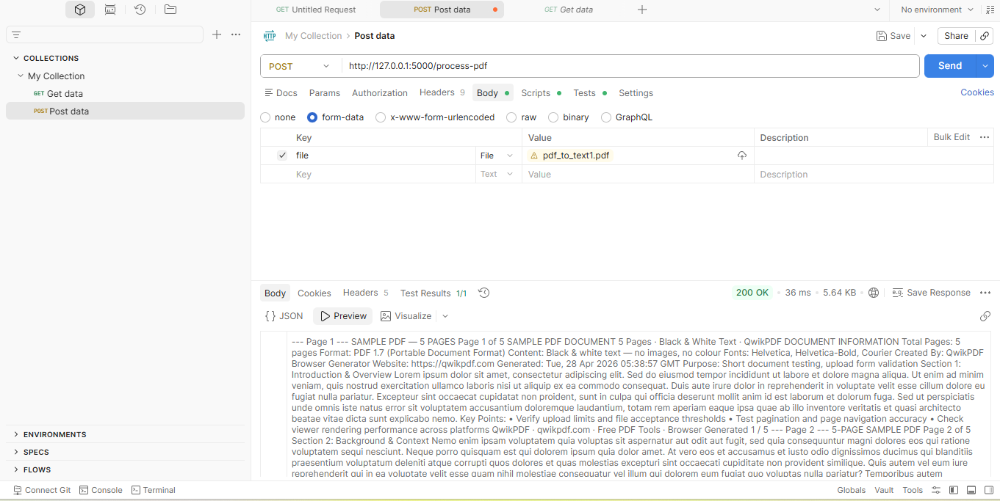
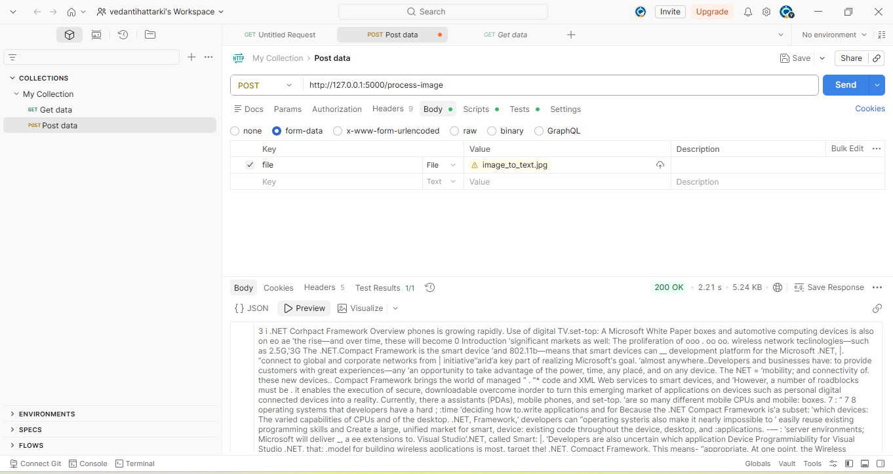
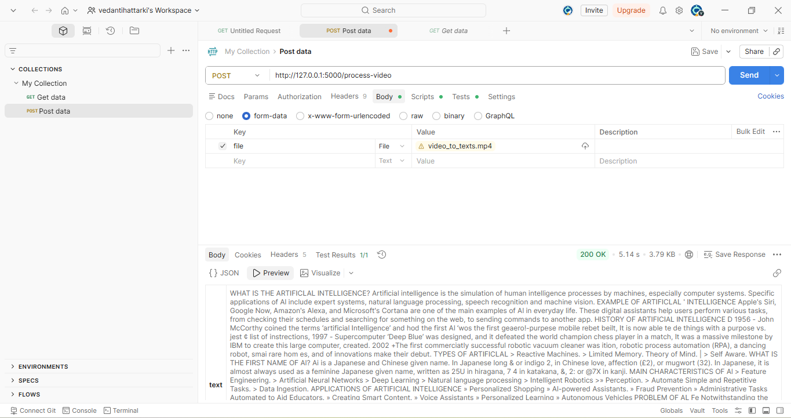
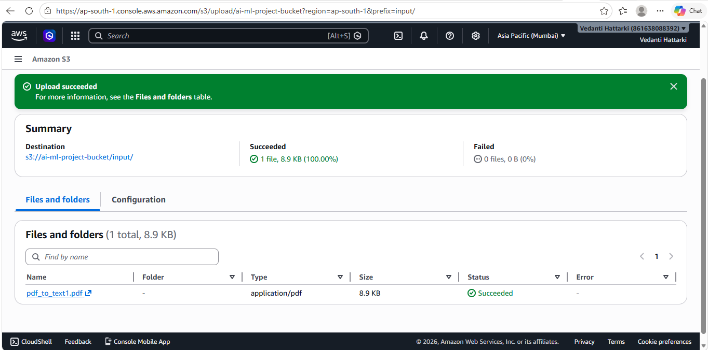
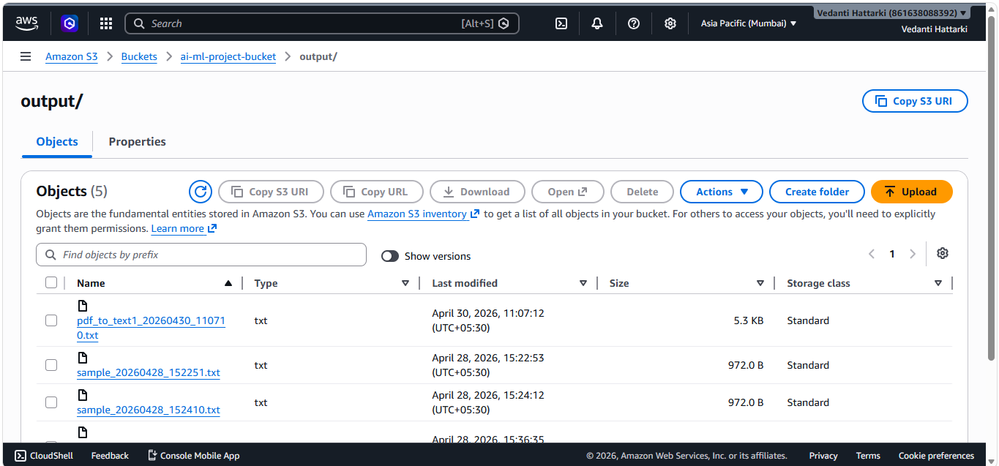
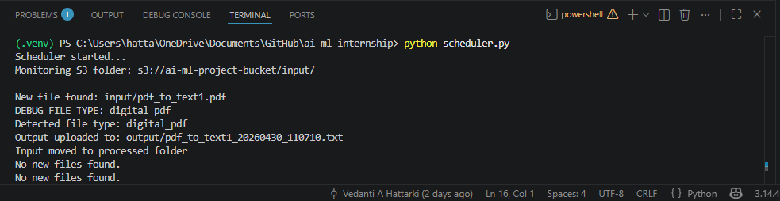
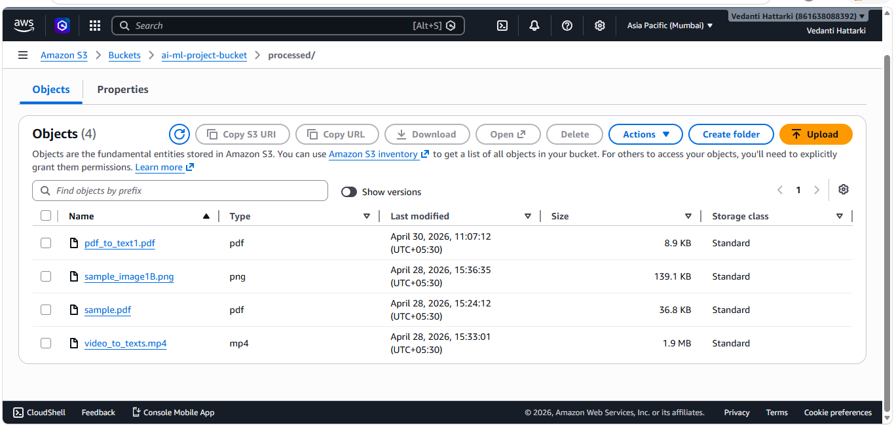
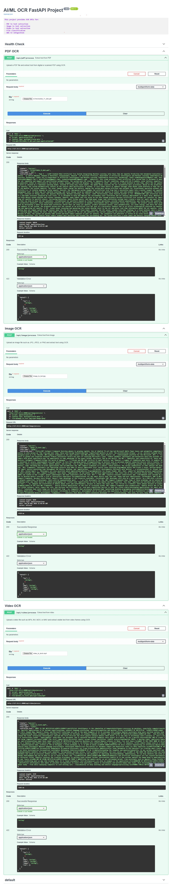

# AI-ML Internship Project

## OCR File Processing and Automation System

This project is an end-to-end **OCR (Optical Character Recognition) Automation System** that processes **PDFs, Images, and Videos** to extract text.

The system is designed using:

* **Flask APIs** is an API built using Flask(a Python Framework) that allows users or systems to send and get responses over the internet.In this project it is used for exposing the functionalities using REST(**Representational State Transfer** - A standard way of communicating over the internet using HTTP).

* **AWS S3** is a service used to store and retrieve files (data) over the internet. In this project AWS S3 is used to store input and output files in a sclable, reliable and cloud-based storage system that enables automated processing workflows.

* **Scheduler** is a program that runs tasks automatically at regular intervals. In this project it is used to monitor S3 input folder for regular intervals of time if any new files are found then processes the files automatically and stores the output in output folder and sends the input file to processed file after processing (automated processing).

* **Classifier** is a component that identifies or categorizes input into different types.In this project it is used for intelligent file handling. When new file is uploaded in AWS S3, classifier identifies it and decides it is pdf, image or video and classifies accordingly.

It simulates a real-world backend system where files are automatically processed and results are stored in the cloud.

---

## Key Features

* Extract text from:
  * Digital PDFs
  * Images
  * Videos
*  REST APIs using Flask
*  API testing using Postman
*  AWS S3 integration (input/output automation)
*  Scheduler to monitor S3 folder
*  Intelligent file classifier
*  Improved video OCR (duplicate removal + noise filtering)
*  Clean and structured output generation

---

## Project Structure

```text
ai-ml-internship/
│
├── app/
│   ├── __init__.py
│   ├── main.py
│
│   ├── api/
│   │   ├── __init__.py
│   │   ├── routes_health.py
│   │   ├── routes_image.py
│   │   ├── routes_pdf.py
│   │   └── routes_video.py
│
│   ├── core/
│   │   ├── __init__.py
│   │   └── config.py
│
│   ├── services/
│   │   ├── __init__.py
│   │   ├── image_service.py
│   │   ├── pdf_service.py
│   │   ├── video_service.py
│   │   ├── classifier_service.py
│   │   └── s3_service.py
│
│   └── utils/
│       ├── __init__.py
│       └── file_utils.py
│
├── old_code/
│   └── previous Flask and standalone OCR files
│
├── sample_files/
│   ├── images/
│   ├── pdfs/
│   └── videos/
│
├── screenshots/
├── temp/
├── tests/
│
├── scheduler.py
├── run.py
├── requirements.txt
├── README.md
└── .gitignore
```

---

## Technologies Used

* Python
* FastAPI
* Swagger UI
* Uvicorn
* OpenCV
* PyTesseract OCR
* PyMuPDF
* PDF2Image
* NumPy
* Pillow
* AWS S3
* Boto3
* Python Dotenv
* Schedule

---

## How the FastAPI Flow Works

```text
User uploads a file through Swagger UI
        ↓
FastAPI route receives the uploaded file
        ↓
File is saved temporarily in temp/
        ↓
Related service function is called
        ↓
OCR processing is performed
        ↓
Extracted text is returned as JSON response
```

Example response:

```json
{
  "status": "success",
  "filename": "sample.pdf",
  "file_type": "pdf",
  "extracted_text": "Extracted text appears here"
}
```

---

## API Endpoints

###  API Testing (Postman)

### process-pdf



### process-image



### process-video



###  AWS S3 Input



###  AWS S3 Output



###  Scheduler Execution



### AWS S3 Processed



### FastAPI Swagger UI


## How to Run the Project

### 1. Clone the Repository

```bash
git clone https://github.com/VedantiAHattarki/ai-ml-internship.git
cd ai-ml-internship
```

---

### 2. Create a Virtual Environment

```bash
python -m venv .venv
```

---

### 3. Activate the Virtual Environment

For Windows PowerShell:

```powershell
.\.venv\Scripts\Activate.ps1
```

After activation, the terminal should show:

```text
(.venv)
```

---

### 4. Install Dependencies

```bash
python -m pip install -r requirements.txt
```

---

### 5. Run the FastAPI Application

```bash
python run.py
```

If the application starts successfully, the terminal will show:

```text
Uvicorn running on http://127.0.0.1:8000
```

---

### 6. Open Swagger UI

Open this URL in the browser:

```text
http://127.0.0.1:8000/docs
```

---

## Testing APIs in Swagger UI

1. Open Swagger UI.
2. Select the API endpoint.
3. Click `Try it out`.
4. Upload a file if required.
5. Click `Execute`.
6. Check the response body.

This allows image, PDF, and video APIs to be tested directly from the browser.

---

## Running the Scheduler

The scheduler is used for AWS S3 automation.

Run:

```bash
python scheduler.py
```

The scheduler monitors the S3 input folder and automatically processes new files.

---

## Environment Variables

The project uses `.env` for configuration.

Example `.env` file:

```env
AWS_REGION=ap-south-1
INPUT_BUCKET=ai-ml-project-bucket
OUTPUT_BUCKET=ai-ml-project-bucket
INPUT_PREFIX=input/
OUTPUT_PREFIX=output/
PROCESSED_PREFIX=processed/
TEMP_FOLDER=temp
```

If AWS credentials are needed locally:

```env
AWS_ACCESS_KEY_ID=your_access_key
AWS_SECRET_ACCESS_KEY=your_secret_key
```

The `.env` file should not be pushed to GitHub.

---

## Classifier Logic

The classifier identifies the uploaded file type based on its extension and content.

It supports:

* Digital PDF
* Scanned PDF
* Image
* Video
* Unknown file type

Based on the classification result, the file is routed to the correct OCR service.

---

## Output

The extracted text is returned through the API response.

For S3 automation, the extracted text is saved as a `.txt` file and uploaded to the S3 `output/` folder.

---

## Current Status

Completed:

* Converted old OCR programs into a modular FastAPI package
* Added API routes for image, PDF, and video processing
* Added Swagger UI support
* Tested APIs successfully through Swagger UI
* Added virtual environment support
* Updated `requirements.txt`
* Added `.gitignore`
* Organized old files under `old_code`
* Added S3 scheduler support using the new package structure

---

## Limitations

* OCR accuracy depends on the quality of the input file
* Low-resolution images may produce incorrect text
* Video OCR may take more time for longer videos
* Some extracted text may contain spelling or formatting errors
* Scanned PDF processing requires Tesseract and Poppler setup

---

## Future Enhancements

* Add Pytest unit tests
* Generate test coverage report using pytest-cov
* Add benchmarking using pytest-benchmark and timeit
* Add GitHub Actions for automatic build and testing
* Deploy the application using AWS App Runner
* Create AWS CloudFormation templates
* Improve OCR accuracy using better preprocessing
* Add a simple Streamlit frontend
* Explore EasyOCR or AWS Textract for improved OCR accuracy

---

## Screenshots

### FastAPI Swagger UI

```text
screenshots/swagger_ui.png
```

### Image API Output

```text
screenshots/image_api_output.png
```

### PDF API Output

```text
screenshots/pdf_api_output.png
```

### Video API Output

```text
screenshots/video_api_output.png
```

### AWS S3 Input

```text
screenshots/s3_input.png
```

### AWS S3 Output

```text
screenshots/s3_output.png
```

### Scheduler Execution

```text
screenshots/scheduler.png
```

---

## Learning Outcome

Through this project, I learned how to build a backend OCR processing system using Python. I also understood how to organize code into a package structure, expose APIs using FastAPI, test APIs using Swagger UI, manage dependencies using a virtual environment, and connect the workflow with AWS S3 automation.

This project helped me understand how separate Python scripts can be converted into a more structured and maintainable backend application.

---

## Author

**Vedanti Hattarki**
