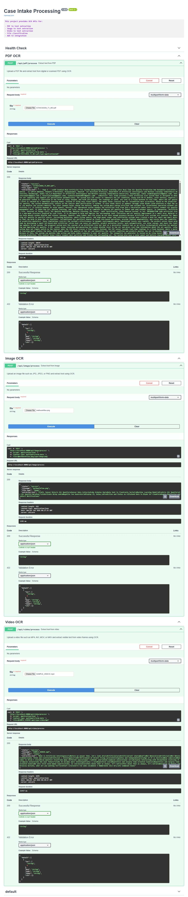
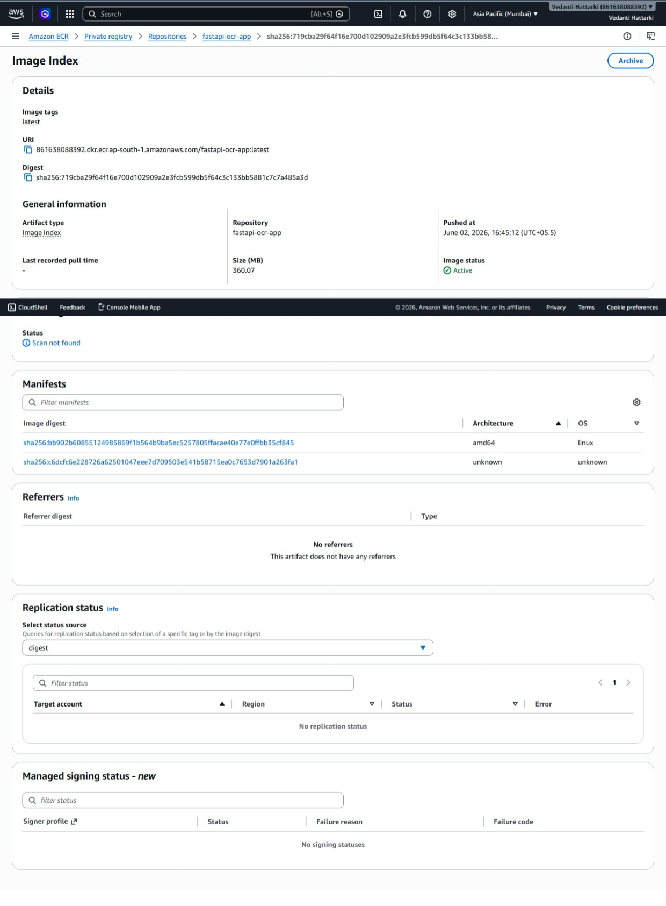
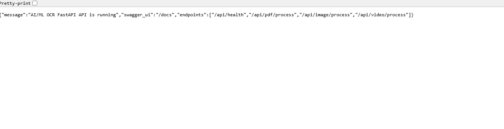
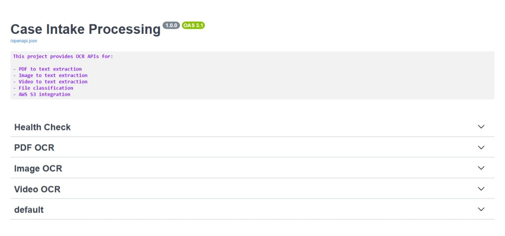
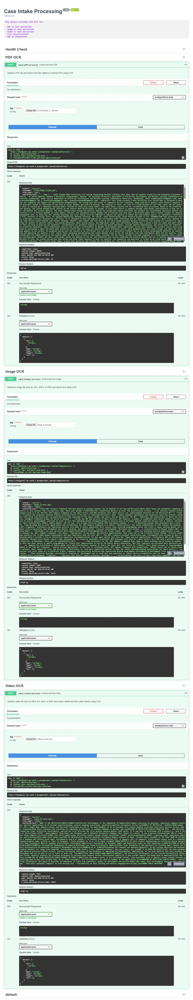
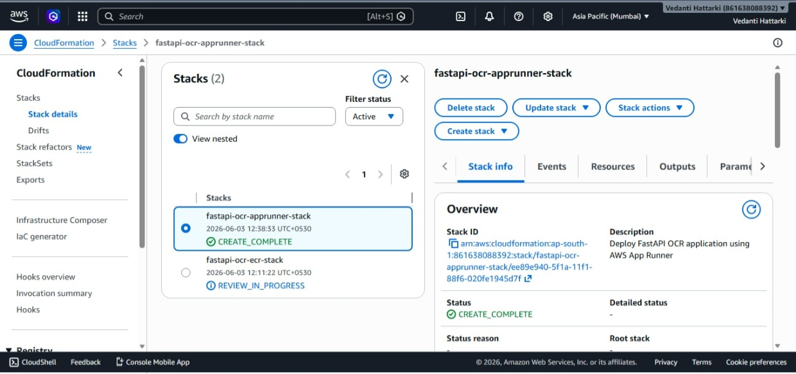
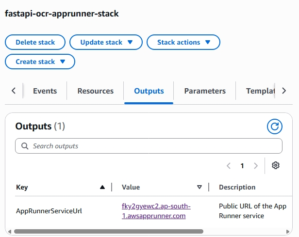

# Case Intake Processor

A FastAPI-based OCR application developed during an AI/ML internship to extract text from **PDFs, images, and videos**.
The project includes local API development, Swagger UI testing, Docker containerization, AWS ECR image storage, and AWS App Runner deployment using CloudFormation.

---

## Project Objective

The main objective of this project is to build an OCR-based API system that can process different file types and extract readable text using Python-based OCR techniques.

The project was developed step by step, starting from basic OCR scripts and later converted into a structured FastAPI application. The final version was containerized using Docker and deployed on AWS App Runner using CloudFormation templates.

---

## Key Features

* Extracts text from digital and scanned PDF files
* Extracts text from image files
* Extracts text from video frames
* Provides REST API endpoints using FastAPI
* Includes Swagger UI for easy API testing
* Supports Docker-based containerization
* Stores Docker image in Amazon ECR
* Deploys application using AWS App Runner
* Uses AWS CloudFormation for infrastructure deployment
* Includes testing support using Pytest and coverage tools

---

## Technology Stack

| Category             | Tools / Technologies                        |
| -------------------- | ------------------------------------------- |
| Programming Language | Python                                      |
| API Framework        | FastAPI                                     |
| API Server           | Uvicorn                                     |
| OCR Engine           | Tesseract OCR                               |
| Image Processing     | OpenCV, Pillow                              |
| PDF Processing       | PyMuPDF, pdf2image, Poppler                 |
| Cloud Services       | AWS ECR, AWS App Runner, AWS CloudFormation |
| Containerization     | Docker                                      |
| Testing              | Pytest, pytest-cov, pytest-benchmark        |
| Automation           | GitHub Actions                              |
| Version Control      | Git, GitHub                                 |

---

## Final Project Structure

```text
ai-ml-internship/
│
├── app/
│   ├── main.py
│   ├── api/
│   ├── services/
│   ├── utils/
│   └── core/
│
├── cloudformation/
│   ├── ecr.yaml
│   └── apprunner-template.yaml
│
├── .github/
│   └── workflows/
│
├── old_code/
├── sample_files/
├── screenshots/
├── tests/
│
├── Dockerfile
├── .dockerignore
├── .gitignore
├── pytest.ini
├── requirements.txt
├── run.py
├── scheduler.py
└── README.md
```

### Folder Explanation

| Folder / File        | Purpose                                     |
| -------------------- | ------------------------------------------- |
| `app/`               | Final FastAPI application package           |
| `app/api/`           | API route files                             |
| `app/services/`      | OCR processing logic                        |
| `app/utils/`         | Helper functions                            |
| `cloudformation/`    | AWS deployment templates                    |
| `.github/workflows/` | GitHub Actions workflow files               |
| `old_code/`          | Earlier development versions and trial code |
| `sample_files/`      | Sample PDFs, images, or videos for testing  |
| `screenshots/`       | Output and deployment proof screenshots     |
| `tests/`             | Test cases for the application              |
| `Dockerfile`         | Docker image configuration                  |
| `scheduler.py`       | Earlier S3 automation scheduler task        |
| `requirements.txt`   | Python dependencies                         |

---

## System Requirements

Before running this project, the following software should be installed:

### Required Installations

1. **Python 3.10 or above**
2. **Tesseract OCR**
3. **Poppler**
4. **Docker Desktop**
5. **AWS CLI**
6. **Git**

---

## Local Setup

### 1. Clone the Repository

```bash
git clone https://github.com/your-username/ai-ml-internship.git
cd ai-ml-internship
```

Replace `your-username` with your actual GitHub username.

---

### 2. Create and Activate Virtual Environment

For Windows PowerShell:

```powershell
python -m venv .venv
.venv\Scripts\activate
```

---

### 3. Install Dependencies

```bash
pip install --upgrade pip
pip install -r requirements.txt
```

---

### 4. Run the FastAPI Application

```bash
uvicorn app.main:app --reload
```

Or:

```bash
python run.py
```

---

### 5. Open Application Locally

Root endpoint:

```text
http://127.0.0.0:8000
```

Swagger UI:

```text
http://127.0.0.0:8000/docs
```

---

## API Endpoints

| Method | Endpoint             | Description                       |
| ------ | -------------------- | --------------------------------- |
| GET    | `/`                  | Checks whether the API is running |
| GET    | `/api/health`        | Health check endpoint             |
| POST   | `/api/pdf/process`   | Extracts text from PDF files      |
| POST   | `/api/image/process` | Extracts text from image files    |
| POST   | `/api/video/process` | Extracts text from video files    |

---

## Swagger UI Testing

Swagger UI is used to test all API endpoints directly from the browser.

Steps:

1. Start the FastAPI server.
2. Open `http://127.0.0.1:8000/docs`.
3. Select the required endpoint.
4. Click **Try it out**.
5. Upload a PDF, image, or video file.
6. Click **Execute**.
7. View the extracted text response.

### Local Swagger UI Screenshot

Add your screenshot here:

```markdown

```

---

## Docker Setup

Docker is used to containerize the FastAPI OCR application so that it can run consistently in any environment.

### 1. Build Docker Image

```bash
docker build -t fastapi-ocr-app .
```

### 2. Run Docker Container

```bash
docker run -p 8000:8000 fastapi-ocr-app
```

### 3. Open Dockerized Application

```text
http://localhost:8000
```

Swagger UI:

```text
http://localhost:8000/docs
```

### Docker Running Screenshot

```markdown

```

---

## AWS Deployment Overview

The final application was deployed on AWS using the following flow:

```text
FastAPI Application
        ↓
Docker Image
        ↓
Amazon ECR
        ↓
AWS App Runner
        ↓
Public API URL
```

CloudFormation was used to automate the creation and deployment of AWS resources.

---

## AWS Services Used

### 1. Amazon ECR

Amazon Elastic Container Registry was used to store the Docker image of the FastAPI OCR application.

### 2. AWS App Runner

AWS App Runner was used to deploy and run the containerized FastAPI application as a public web service.

### 3. AWS CloudFormation

CloudFormation templates were used to define and create AWS resources in an automated and repeatable way.

---

## AWS Deployment Steps

### Step 1: Create ECR Repository

CloudFormation template used:

```text
cloudformation/ecr.yaml
```

Command:

```powershell
aws cloudformation deploy --template-file cloudformation/ecr.yaml --stack-name fastapi-ocr-ecr-stack --region ap-south-1
```

This creates the ECR repository:

```text
fastapi-ocr-app
```

---

### Step 2: Build Docker Image

```powershell
docker build -t fastapi-ocr-app .
```

---

### Step 3: Login Docker to ECR

```powershell
aws ecr get-login-password --region ap-south-1 | docker login --username AWS --password-stdin 861638088392.dkr.ecr.ap-south-1.amazonaws.com
```

---

### Step 4: Tag Docker Image

```powershell
docker tag fastapi-ocr-app:latest 861638088392.dkr.ecr.ap-south-1.amazonaws.com/fastapi-ocr-app:latest
```

---

### Step 5: Push Docker Image to ECR

```powershell
docker push 861638088392.dkr.ecr.ap-south-1.amazonaws.com/fastapi-ocr-app:latest
```

After this step, the Docker image is available in Amazon ECR with the tag:

```text
latest
```

### ECR Image Screenshot

```markdown

```

---

### Step 6: Deploy App Runner Using CloudFormation

CloudFormation template used:

```text
cloudformation/apprunner-template.yaml
```

Command:

```powershell
aws cloudformation deploy --template-file cloudformation/apprunner-template.yaml --stack-name fastapi-ocr-apprunner-stack --region ap-south-1 --capabilities CAPABILITY_NAMED_IAM --parameter-overrides ImageIdentifier=861638088392.dkr.ecr.ap-south-1.amazonaws.com/fastapi-ocr-app:latest
```

This creates the AWS App Runner service and deploys the FastAPI OCR application.

---

### Step 7: Get App Runner Public URL

```powershell
aws cloudformation describe-stacks --stack-name fastapi-ocr-apprunner-stack --region ap-south-1 --query "Stacks[0].Outputs[0].OutputValue" --output text --no-cli-pager
```

Deployed URL:

```text
https://fky2gyewc2.ap-south-1.awsapprunner.com
```

Swagger UI:

```text
https://fky2gyewc2.ap-south-1.awsapprunner.com/docs
```

---

## Deployment Verification

The deployed application returned the following success response:

```json
{
  "status": "success",
  "message": "FastAPI OCR project is running successfully"
}
```

### Deployed Application Screenshot

```markdown

```

### Deployed Swagger UI Screenshot

```markdown


```

---

## CloudFormation Verification

The App Runner CloudFormation stack was successfully created.

Stack name:

```text
fastapi-ocr-apprunner-stack
```

Final status:

```text
CREATE_COMPLETE
```

### CloudFormation Stack Screenshot

```markdown

```

### CloudFormation Output Screenshot

```markdown

```

---

## App Runner Verification

The AWS App Runner service was created successfully and the application was publicly accessible through the App Runner service URL.

Service name:

```text
fastapi-ocr-app-runner
```

### App Runner Running Screenshot

```markdown

```

---

## Testing

The project supports Pytest for unit testing and coverage checking.

### Run Tests

```bash
pytest
```

### Run Tests with Coverage

```bash
pytest --cov=app
```

### Generate HTML Coverage Report

```bash
pytest --cov=app --cov-report=html
```

The generated report is available inside:

```text
htmlcov/index.html
```

---

## GitHub Actions

GitHub Actions is used to automatically check the project when code is pushed to GitHub.

The workflow is available inside:

```text
.github/workflows/
```

It helps automate:

* Dependency installation
* Test execution
* Build verification
* Continuous integration checks

---

## Screenshots Included

The following screenshots are included as proof of project completion:

| Screenshot                              | Description                             |
| --------------------------------------- | --------------------------------------- |
| `01_docker_running_local.png`           | Docker container running locally        |
| `02_local_swagger_ui.png`               | Local FastAPI Swagger UI                |
| `03_ecr_latest_image.png`               | Docker image pushed to ECR              |
| `04_cloudformation_create_complete.png` | CloudFormation stack status             |
| `05_cloudformation_outputs_url.png`     | App Runner public URL from stack output |
| `06_apprunner_running_status.png`       | App Runner service running              |
| `07_deployed_app_success.png`           | Deployed API success response           |
| `08_deployed_swagger_ui.png`            | Deployed Swagger UI                     |

---

## Troubleshooting Notes

### 1. Invalid Template Path

If the following error appears:

```text
Invalid template path
```

Check whether the template file exists:

```powershell
dir cloudformation
```

Use the correct file name:

```text
cloudformation/apprunner-template.yaml
```

---

### 2. Stack in ROLLBACK_COMPLETE State

If CloudFormation shows:

```text
Stack is in ROLLBACK_COMPLETE state and cannot be updated
```

Delete the failed stack:

```powershell
aws cloudformation delete-stack --stack-name fastapi-ocr-apprunner-stack --region ap-south-1
```

Then deploy again.

---

### 3. Parameter Value Missing

If this error appears:

```text
Parameters: [ImageIdentifier] must have values
```

Use the correct parameter name:

```text
ImageIdentifier
```

---

### 4. Port Mismatch

The application should run on port:

```text
8000
```

The Dockerfile and App Runner template should both use port `8000`.

---

## Security Notes

Do not push secret or generated files to GitHub.

Make sure the following files and folders are ignored:

```text
.env
.venv/
AWS credentials
Access keys
Secret keys
__pycache__/
.pytest_cache/
.coverage
htmlcov/
temp/
```

---

## Cleanup After Verification

AWS App Runner can create charges while it is running. After mentor verification or final submission, delete the deployed resources.

### Delete App Runner Stack

```powershell
aws cloudformation delete-stack --stack-name fastapi-ocr-apprunner-stack --region ap-south-1
```

### Delete ECR Images

Go to:

```text
AWS Console → ECR → Repositories → fastapi-ocr-app → Images → Delete
```

### Delete ECR Stack

```powershell
aws cloudformation delete-stack --stack-name fastapi-ocr-ecr-stack --region ap-south-1
```

---


## Final Summary

This project demonstrates the complete workflow of building and deploying an OCR-based FastAPI application. It includes OCR processing, API development, Docker containerization, AWS ECR image storage, AWS App Runner deployment, and CloudFormation-based infrastructure automation. The final deployed application is accessible through a public App Runner URL and can be tested using Swagger UI.


## Author

**Vedanti A Hattarki**  
AI/ML Intern  

This project was developed as part of an AI/ML internship, focusing on OCR-based text extraction, FastAPI API development, Docker containerization, and AWS App Runner deployment using CloudFormation.

GitHub: [VedantiAHattarki](https://github.com/VedantiAHattarki)