# Case Intake Processor

An end-to-end **OCR-based Case Intake Processor** developed during an AI/ML internship for processing pharmacovigilance case-intake data.

The application accepts **PDF documents, images, and videos**, extracts text using OCR, exposes the processing functionality through a **FastAPI REST API and Swagger UI**, and provides a **React + Vite frontend** for user interaction.

The project was progressively containerized and deployed using **Docker, AWS ECR, AWS App Runner, AWS ECS, AWS EKS, Kubernetes, CloudFormation, Elastic Load Balancing, and Kubernetes Horizontal Pod Autoscaling (HPA)**.

---

## Table of Contents

- [Project Overview](#project-overview)
- [Project Objective](#project-objective)
- [Key Features](#key-features)
- [Application Workflow](#application-workflow)
- [System Architecture](#system-architecture)
- [Technology Stack](#technology-stack)
- [Project Structure](#project-structure)
- [Backend Application](#backend-application)
- [Frontend Application](#frontend-application)
- [OCR Processing](#ocr-processing)
- [API Endpoints](#api-endpoints)
- [Swagger UI](#swagger-ui)
- [Local Development](#local-development)
- [Dockerization](#dockerization)
- [Docker Compose](#docker-compose)
- [Testing](#testing)
- [CI/CD](#cicd)
- [AWS ECR](#aws-ecr)
- [AWS App Runner](#aws-app-runner)
- [AWS CloudFormation](#aws-cloudformation)
- [AWS ECS Deployment](#aws-ecs-deployment)
- [AWS EKS Deployment](#aws-eks-deployment)
- [Kubernetes Resources](#kubernetes-resources)
- [Horizontal Pod Autoscaling](#horizontal-pod-autoscaling)
- [Elastic Load Balancing](#elastic-load-balancing)
- [Deployment Screenshots](#deployment-screenshots)
- [Configuration](#configuration)
- [Troubleshooting](#troubleshooting)
- [Security and Production Considerations](#security-and-production-considerations)
- [Future Enhancements](#future-enhancements)
- [Conclusion](#conclusion)

---

## Project Overview

The **Case Intake Processor** is an OCR application designed to extract text from different types of case-intake files.

The application supports:

- Digital PDFs
- Scanned PDFs
- Images
- Videos

The backend is implemented using **FastAPI** and uses **PyTesseract** and **OpenCV** for OCR and image/frame processing.

The frontend is implemented using **React + Vite** and provides a simple interface for uploading supported files and viewing processing results.

The application was then containerized using Docker and deployed through multiple AWS services to demonstrate cloud deployment, container orchestration, scalability, and load balancing.

---

## Project Objective

The primary objective of the project was to build and deploy an OCR-based case-intake processing application capable of:

1. Accepting PDF, image, and video files.
2. Extracting text from uploaded files using OCR.
3. Providing REST APIs for each processing operation.
4. Providing Swagger UI for API testing and documentation.
5. Providing a web-based React frontend.
6. Containerizing the backend and frontend using Docker.
7. Storing Docker images in Amazon ECR.
8. Deploying the application using AWS App Runner.
9. Automating AWS infrastructure creation using CloudFormation.
10. Deploying containerized services on Amazon ECS.
11. Deploying the application on Amazon EKS using Kubernetes.
12. Configuring Kubernetes deployments and services.
13. Implementing Horizontal Pod Autoscaling.
14. Configuring Elastic Load Balancers for application access.
15. Testing the application locally and in cloud environments.

---

## Key Features

### OCR Processing

- PDF OCR
- Image OCR
- Video OCR
- Processing of scanned documents
- Text extraction using PyTesseract
- Image preprocessing using OpenCV

### Backend

- FastAPI REST API
- Swagger UI
- Health-check endpoint
- Separate endpoints for PDF, image, and video processing
- CORS configuration for frontend communication

### Frontend

- React
- Vite
- File upload interface
- PDF upload
- Image upload
- Video upload
- Display of processing results

### Containerization

- Docker
- Docker Compose
- Separate backend and frontend containers
- Container image management using Amazon ECR

### AWS Deployment

- Amazon ECR
- AWS App Runner
- AWS CloudFormation
- Amazon ECS
- Amazon EKS
- Kubernetes
- Kubernetes Services
- Kubernetes Deployments
- Kubernetes HPA
- Elastic Load Balancing / Application Load Balancers

### Testing and CI/CD

- Pytest
- 16 automated tests
- Test coverage improved to approximately 84%
- GitHub Actions CI pipeline

---

# Application Workflow

```text
                 User
                  |
                  v
        React + Vite Frontend
                  |
                  v
             FastAPI API
                  |
       +----------+----------+
       |          |          |
       v          v          v
      PDF       Image      Video
       |          |          |
       +----------+----------+
                  |
                  v
       OpenCV + PyTesseract
                  |
                  v
          Extracted Text
                  |
                  v
          API / UI Response
```

For cloud deployment, the application can be accessed through the corresponding AWS deployment endpoint or load balancer.

---

# System Architecture

```text
                        +----------------------+
                        |        User          |
                        +----------+-----------+
                                   |
                                   v
                        +----------------------+
                        | React + Vite Frontend|
                        +----------+-----------+
                                   |
                                   v
                        +----------------------+
                        |   FastAPI Backend    |
                        +----------+-----------+
                                   |
             +---------------------+---------------------+
             |                     |                     |
             v                     v                     v
       PDF Processing        Image Processing      Video Processing
             |                     |                     |
             +---------------------+---------------------+
                                   |
                                   v
                         OpenCV + PyTesseract
                                   |
                                   v
                            Extracted Text


       Docker
          |
          v
     Amazon ECR
          |
    +-----+------------------+
    |                        |
    v                        v
AWS App Runner          AWS ECS / AWS EKS
                             |
                    +--------+--------+
                    |                 |
                    v                 v
             Load Balancer       Kubernetes HPA
```

---

# Technology Stack

| Category | Technology |
|---|---|
| Programming Language | Python |
| Backend Framework | FastAPI |
| OCR | PyTesseract |
| Image Processing | OpenCV |
| Frontend | React |
| Frontend Build Tool | Vite |
| API Documentation | Swagger UI / OpenAPI |
| Testing | Pytest |
| Code Coverage | Coverage.py / Pytest Coverage |
| Containerization | Docker |
| Local Orchestration | Docker Compose |
| Source Control | Git / GitHub |
| CI/CD | GitHub Actions |
| Container Registry | Amazon ECR |
| Application Deployment | AWS App Runner |
| Infrastructure as Code | AWS CloudFormation |
| Container Orchestration | Amazon ECS |
| Kubernetes | Amazon EKS |
| Kubernetes CLI | kubectl |
| EKS CLI | eksctl |
| Load Balancing | AWS Elastic Load Balancing / ALB |
| Autoscaling | Kubernetes HPA |
| Cloud Region | AWS `ap-south-1` |

---

````markdown
# Project Structure

A simplified project structure is:

```text
AI-ML-INTERNSHIP/
├── app/                          # FastAPI backend
├── frontend/                     # React + Vite frontend
├── cloudformation/               # AWS CloudFormation templates
├── final_deployment_screenshots/ # Deployment screenshots
├── requirements.txt              # Python dependencies
├── Dockerfile                    # Backend Docker configuration
├── docker-compose.yml             # Local multi-container setup
└── README.md                     # Project documentation
```

# Backend Application

The backend is implemented using **FastAPI**.

The main FastAPI application is located in:

```text
app/main.py
```

The application provides:

- API routing
- CORS configuration
- Health checking
- PDF processing
- Image processing
- Video processing
- Swagger/OpenAPI documentation

The FastAPI application can be started locally using:

```bash
uvicorn app.main:app --reload
```

The backend is available locally at:

```text
http://localhost:8000
```

---

# Frontend Application

The frontend was implemented using **React + Vite**.

The frontend provides a user-friendly interface for:

- Uploading images
- Uploading PDFs
- Uploading videos
- Sending files to the FastAPI backend
- Displaying the OCR processing result

The frontend can be started locally using the appropriate npm commands:

```bash
npm install
npm run dev
```

The Vite development server normally runs at:

```text
http://localhost:5173
```

The frontend was also tested using a Docker-based setup.

---

# OCR Processing

## PDF Processing

The PDF processing functionality supports:

- Digital PDF documents
- Scanned PDF documents

The application processes the document and extracts text using OCR where required.

Endpoint:

```text
POST /api/pdf/process
```

---

## Image Processing

Image files can be uploaded directly for OCR processing.

The application uses OpenCV for image processing and PyTesseract for text extraction.

Endpoint:

```text
POST /api/image/process
```

---

## Video Processing

Video files are processed frame-by-frame.

OpenCV is used to extract frames and PyTesseract is used to perform OCR on suitable frames.

Endpoint:

```text
POST /api/video/process
```

---

# API Endpoints

| Method | Endpoint | Purpose |
|---|---|---|
| GET | `/` | Application/root endpoint |
| GET | `/api/health` | Health check |
| POST | `/api/pdf/process` | Process PDF files |
| POST | `/api/image/process` | Process image files |
| POST | `/api/video/process` | Process video files |

---

# Swagger UI

FastAPI automatically provides interactive API documentation.

After starting the backend, open:

```text
http://localhost:8000/docs
```

Swagger UI allows the APIs to be tested directly from the browser.

### Swagger UI

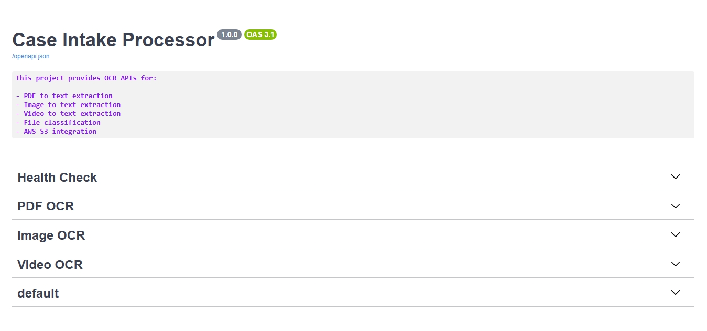

---

# Local Development

## Prerequisites

Install the following:

- Python 3.x
- Node.js and npm
- Git
- Docker Desktop
- AWS CLI
- kubectl
- eksctl

---

## Clone the Repository

```bash
git clone <YOUR_GITHUB_REPOSITORY_URL>
cd AI-ML-INTERNSHIP
```

---

## Backend Setup

Create and activate a virtual environment:

### Windows

```bash
python -m venv venv
venv\Scripts\activate
```

Install dependencies:

```bash
pip install -r requirements.txt
```

Run the FastAPI application:

```bash
uvicorn app.main:app --reload
```

Open:

```text
http://localhost:8000
```

Swagger UI:

```text
http://localhost:8000/docs
```

---

## Frontend Setup

Navigate to the frontend:

```bash
cd frontend
```

Install dependencies:

```bash
npm install
```

Start the development server:

```bash
npm run dev
```

---

# Local Docker Execution

The application was successfully tested using Docker.

The local Docker environment contains the application containers required for running the project.

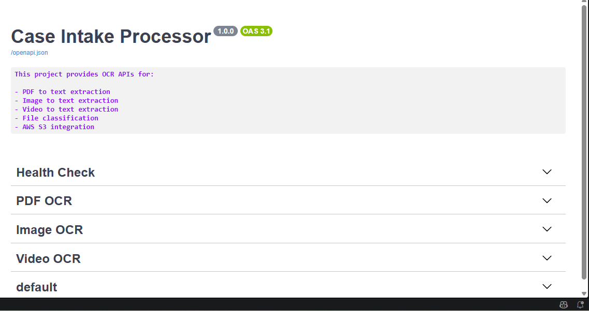

---

# Dockerization

Docker was used to package the application into portable containers.

The project includes separate container images for the backend and frontend.

Docker images were built locally and then pushed to Amazon ECR for cloud deployment.

Useful commands:

```bash
docker build -t fastapi-ocr-app .
```

Run the backend container:

```bash
docker run -p 8000:8000 fastapi-ocr-app
```

List Docker images:

```bash
docker images
```

### Docker Images

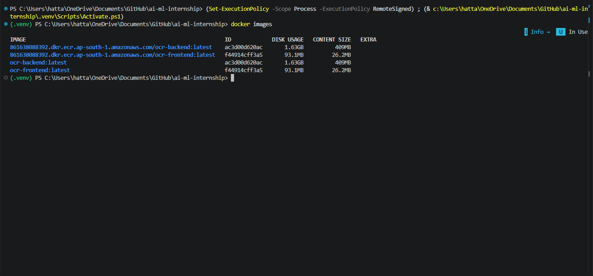

---

# Docker Compose

Docker Compose was used to run the frontend and backend together during local development.

Start the application:

```bash
docker compose up --build
```

Stop the application:

```bash
docker compose down
```

The local setup allowed the frontend and backend to communicate through the configured CORS settings.

---

# Frontend CORS Configuration

The FastAPI application was configured with CORS middleware to allow communication from the local React/Vite frontend.

The development configuration included origins such as:

```text
http://localhost:3000
http://127.0.0.1:3000
http://localhost:5173
http://127.0.0.1:5173
```

This resolved browser CORS issues encountered during frontend-backend integration.

---

# Testing

Automated tests were implemented using **Pytest**.

The test suite collected:

```text
16 tests
```

The tests were successfully executed and passed.

Code coverage was initially around:

```text
48%
```

and was subsequently improved to approximately:

```text
84%
```

Run the tests using:

```bash
pytest
```

Run with coverage:

```bash
pytest --cov=app
```

---

# CI/CD

A GitHub Actions workflow was configured to automate the testing process.

The CI workflow provides automated validation of the application whenever changes are pushed to the repository.

Typical CI workflow:

```text
Developer Push
      |
      v
GitHub Repository
      |
      v
GitHub Actions
      |
      v
Install Dependencies
      |
      v
Run Pytest
      |
      v
Generate Coverage
      |
      v
Build / Validation
```

---

# AWS Deployment

The application was deployed and validated using multiple AWS services.

The primary AWS region used throughout the deployment was:

```text
ap-south-1
```

This is the Mumbai AWS region.

The deployment included:

```text
Docker
   |
   v
Amazon ECR
   |
   +----------------------+
   |                      |
   v                      v
AWS App Runner        ECS / EKS
                          |
                          v
                    Load Balancer
                          |
                          v
                     Application
```

---

# Amazon ECR

Amazon Elastic Container Registry (ECR) was used to store the Docker container images.

The primary ECR repository used for the backend application was:

```text
fastapi-ocr-app
```

The Docker image was built locally and pushed to ECR.

Typical workflow:

```bash
aws configure
```

Authenticate Docker with ECR:

```bash
aws ecr get-login-password --region ap-south-1 | docker login --username AWS --password-stdin <AWS_ACCOUNT_ID>.dkr.ecr.ap-south-1.amazonaws.com
```

Build the image:

```bash
docker build -t fastapi-ocr-app .
```

Tag the image:

```bash
docker tag fastapi-ocr-app:latest <AWS_ACCOUNT_ID>.dkr.ecr.ap-south-1.amazonaws.com/fastapi-ocr-app:latest
```

Push the image:

```bash
docker push <AWS_ACCOUNT_ID>.dkr.ecr.ap-south-1.amazonaws.com/fastapi-ocr-app:latest
```

### ECR Repository

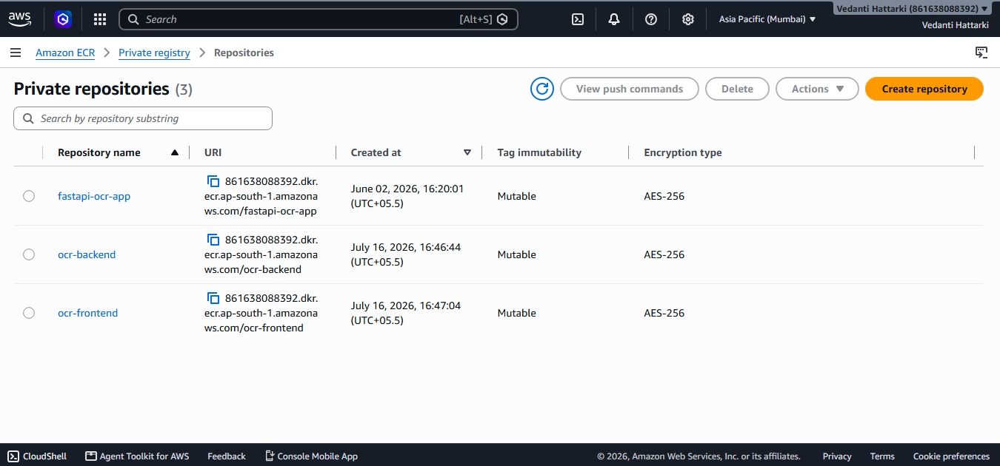

### Latest ECR Image


---

# AWS App Runner

AWS App Runner was used to deploy the containerized FastAPI application.

The deployment used the ECR container image as the application source.

The App Runner deployment was successfully created and reached a running state.

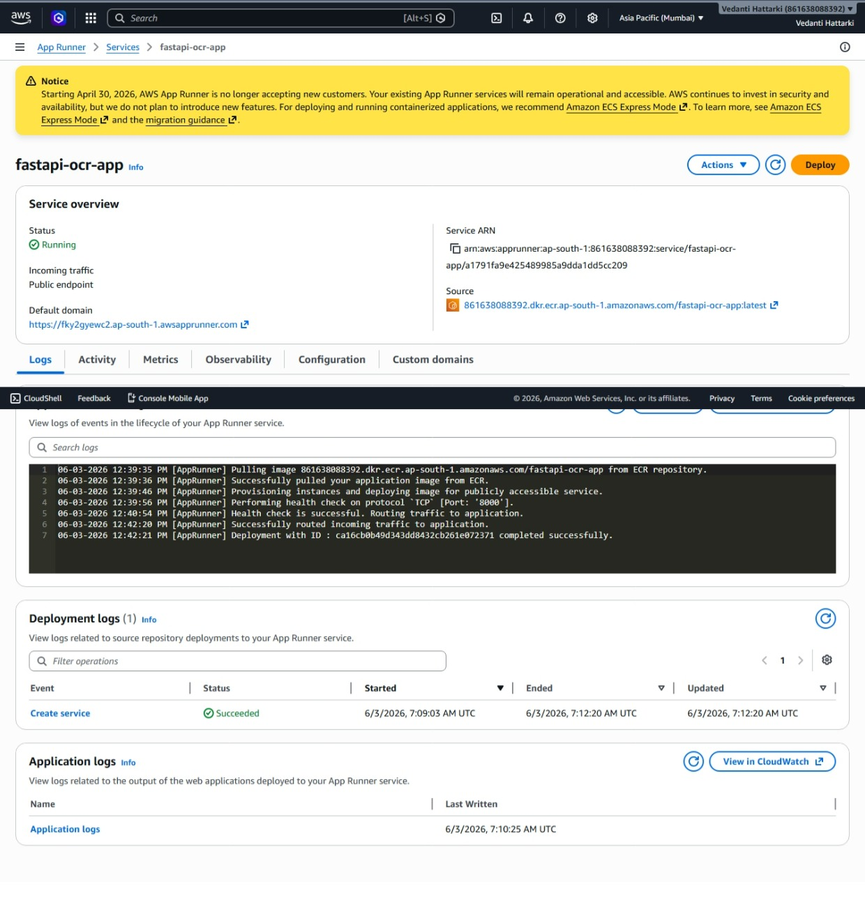

The deployed application was tested after deployment to verify that the application was reachable and functional.


---

# AWS CloudFormation

AWS CloudFormation was used for infrastructure provisioning.

CloudFormation helped automate the creation of required AWS resources instead of configuring every resource manually.

Important CloudFormation stack names used during the project included:

```text
fastapi-ocr-ecr-stack
fastapi-ocr-apprunner-stack
```

The CloudFormation deployment was successfully completed.


CloudFormation outputs were used to retrieve deployment-related URLs and resource information.


A JSON output file was also generated/downloaded during the deployment process.

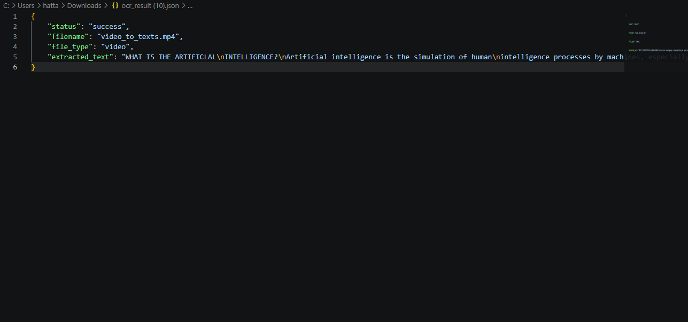

---

# Application Testing Screenshots

## Home Page

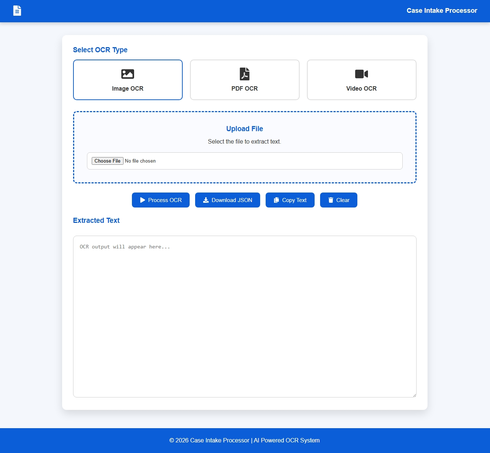

---

## Image Upload

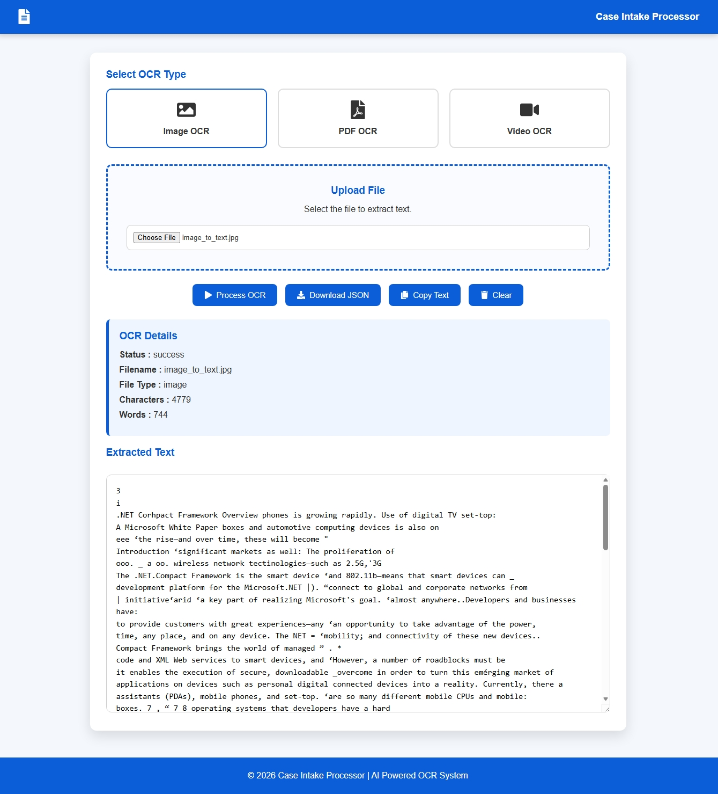

---

## PDF Upload

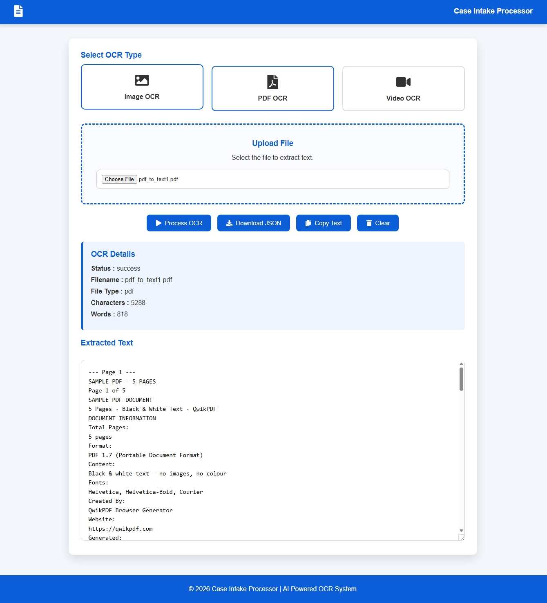

---

## Video Upload

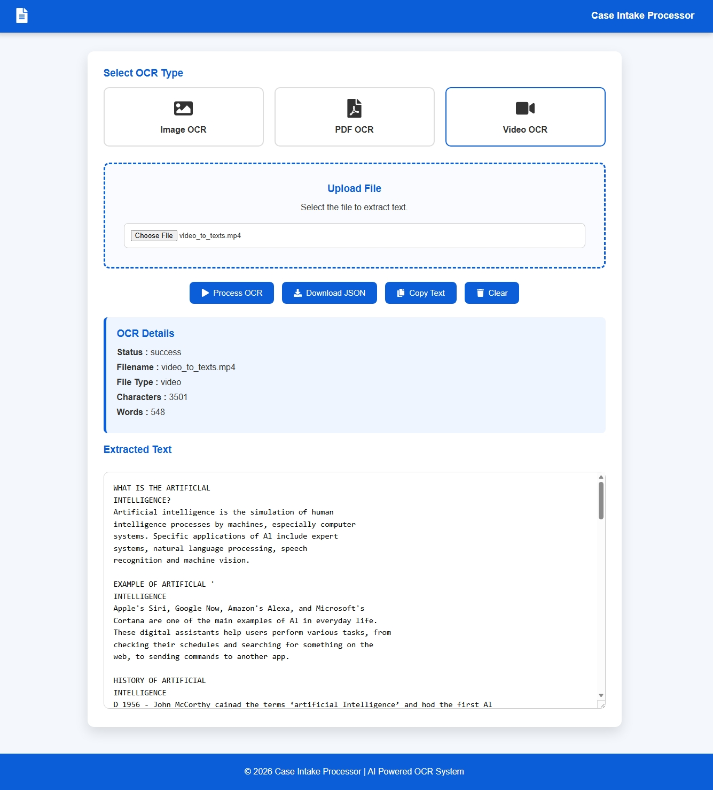

---

## Swagger API Output


---

# AWS ECS Deployment

Amazon Elastic Container Service (ECS) was used to deploy the containerized application in an ECS cluster.

The ECS environment was configured using EC2-backed container instances.

The ECS cluster used during the project was:

```text
ocr-ecs-cluster
```

The backend task definition was:

```text
ocr-backend-task
```

The container exposed:

```text
8000
```

The ECS deployment included:

- ECS Cluster
- EC2 container instances
- Task Definition
- ECS Service
- Backend container
- Target Group
- Application Load Balancer

---

## ECS Cluster

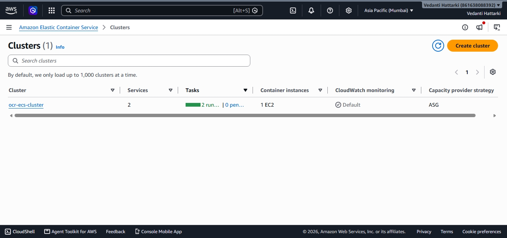

---

## ECS Services

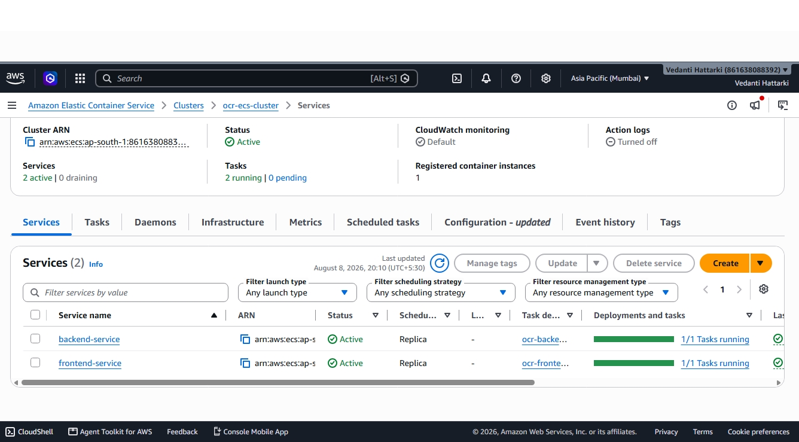

---

# ECS Load Balancing

An Application Load Balancer was configured for the ECS backend service.

The backend target group was configured to forward traffic to the ECS container instances.

The target group used during the deployment was:

```text
backend-target-group
```

The Application Load Balancer used during the deployment was:

```text
backend-alb
```

The load balancer was configured as an internet-facing Application Load Balancer.

---

# AWS EKS Deployment

Amazon Elastic Kubernetes Service (EKS) was used to deploy the application using Kubernetes.

The EKS cluster created for the project was:

```text
ocr-eks-cluster
```

AWS region:

```text
ap-south-1
```

Kubernetes version:

```text
1.34
```

The cluster was created using `eksctl`.

The command used to create the cluster was:

```bash
eksctl create cluster \
  --name ocr-eks-cluster \
  --region ap-south-1 \
  --nodegroup-name workers \
  --node-type t3.small \
  --nodes 2 \
  --nodes-min 2 \
  --nodes-max 4
```

The cluster used a managed node group named:

```text
workers
```

Initial node configuration:

```text
2 x t3.small
```

Node scaling range:

```text
Minimum: 2
Maximum: 4
```

---

## EKS Cluster

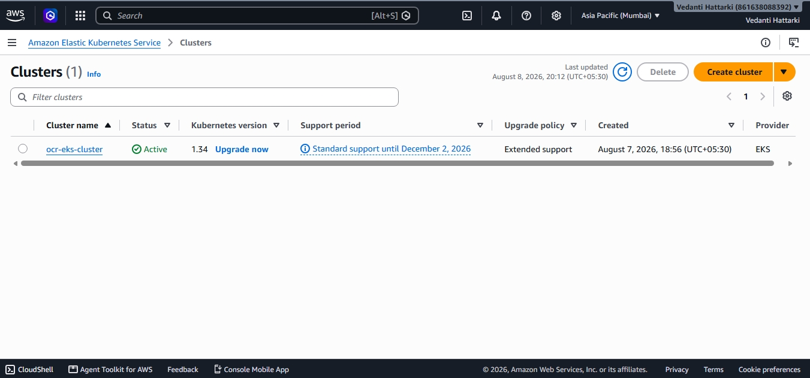

---

# Kubernetes Deployment

The application was deployed to EKS using Kubernetes manifests.

The Kubernetes deployment resources define:

- Container image
- Number of replicas
- Container ports
- Resource configuration
- Environment configuration
- Application deployment behavior

Kubernetes deployments were verified using:

```bash
kubectl get deployments
```

### Kubernetes Deployments

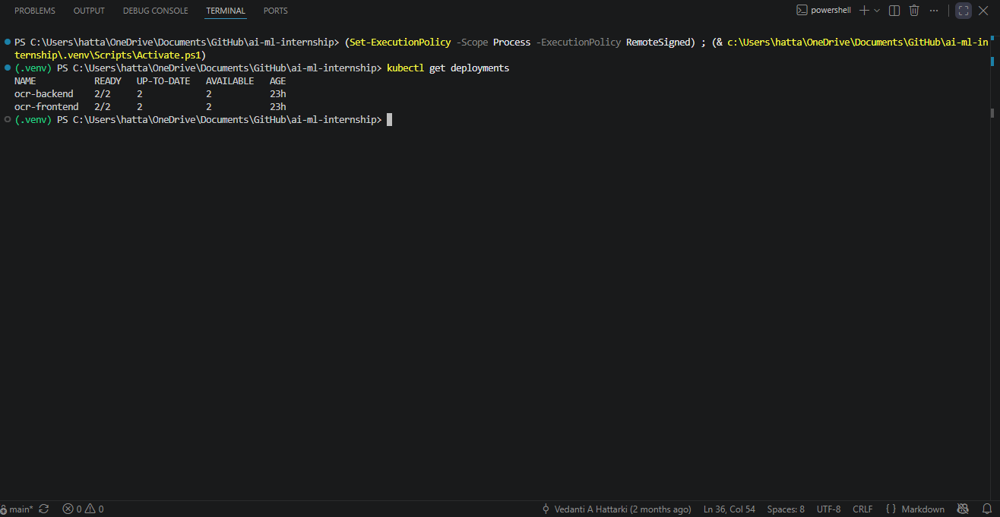

---

# Kubernetes Services

Kubernetes Services were configured to expose the deployed application.

Services were verified using:

```bash
kubectl get services
```

### Kubernetes Services

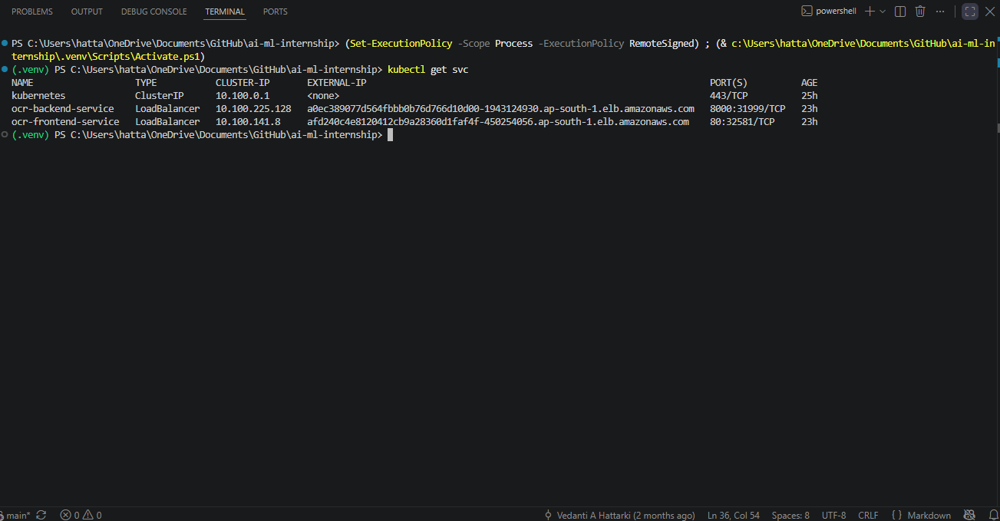

---

# Horizontal Pod Autoscaling

Kubernetes Horizontal Pod Autoscaler (HPA) was configured to provide automatic scaling of application pods based on resource utilization.

HPA can increase or decrease the number of running pods according to the configured scaling policy.

The HPA configuration was verified using:

```bash
kubectl get hpa
```

### Kubernetes HPA

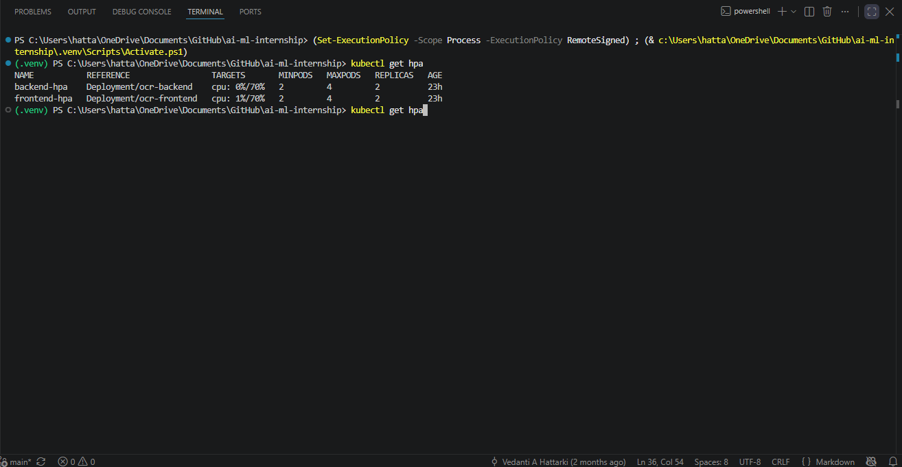

---

# Elastic Load Balancing

A load balancer was configured to provide external access to the deployed application.

The load-balancing architecture is:

```text
                     Internet
                         |
                         v
              Application Load Balancer
                         |
              +----------+----------+
              |                     |
              v                     v
          Backend Pod           Backend Pod
              |                     |
              +----------+----------+
                         |
                         v
                  OCR Processing
```

The load balancer configuration was verified after the Kubernetes deployment.

### Load Balancer

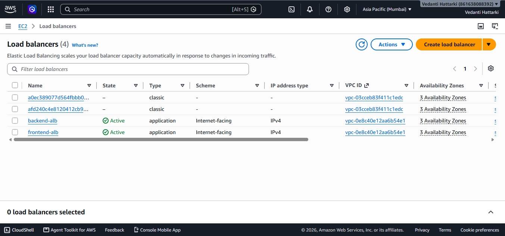

---

# Kubernetes Deployment Flow

```text
Docker Image
     |
     v
Amazon ECR
     |
     v
Amazon EKS
     |
     v
Kubernetes Deployment
     |
     v
Kubernetes Pods
     |
     v
Kubernetes Service
     |
     v
Load Balancer
     |
     v
Application
```

---

# Deployment Verification

The application was verified at multiple stages.

## Local Verification

The application was tested using:

- Docker
- Docker Compose
- FastAPI
- Swagger UI
- React frontend

---

## Cloud Verification

The application was verified using:

- Amazon ECR
- AWS App Runner
- AWS ECS
- Amazon EKS
- Kubernetes Deployments
- Kubernetes Services
- Kubernetes HPA
- Application Load Balancer

---

# Complete Deployment Lifecycle

The overall project deployment lifecycle can be summarized as:

```text
                    Source Code
                        |
                        v
                     GitHub
                        |
                        v
                 GitHub Actions
                        |
                        v
                     Testing
                        |
                        v
                      Docker
                        |
                        v
                    Amazon ECR
                        |
           +------------+-------------+
           |            |             |
           v            v             v
      App Runner       ECS           EKS
                        |             |
                        |             v
                        |       Kubernetes
                        |             |
                        |       +-----+------+
                        |       |            |
                        |       v            v
                        |     Service       HPA
                        |       |            |
                        |       +-----+------+
                        |             |
                        +-------------+
                                      |
                                      v
                               Load Balancer
                                      |
                                      v
                                  Application
```

---

# Configuration

For local development, configure the required application settings according to the environment.

Do not commit sensitive information such as:

- AWS access keys
- AWS secret keys
- Passwords
- API keys
- Private credentials
- Production secrets

Use environment variables or AWS IAM roles wherever possible.

---

# Troubleshooting

### Docker Desktop Engine Issue

During local development on Windows, Docker Desktop initially encountered an issue connecting to its Linux container engine. Since the application uses Linux-based Docker containers, Docker Desktop's Linux container backend must be running correctly.

The issue was resolved by restarting/fixing Docker Desktop and verifying that the Docker engine was running correctly.

Verify Docker:

```bash
docker version
```
Verify running containers:

```bash
docker ps
```

---

## CORS Error

A CORS issue occurred while connecting the React/Vite frontend with the FastAPI backend.

The issue was resolved by configuring FastAPI `CORSMiddleware` with the frontend development origins.

---

## ECS Listener Port Issue

During the ECS deployment, an incorrect listener port configuration was initially selected.

The listener configuration was corrected and the ECS service was successfully created afterward.

---

## Docker Compose Version Warning

Docker Compose reported that the `version` attribute in the Compose file was obsolete.

This warning does not prevent the containers from being built or started.

---

# AWS Resource Summary

| Resource | Name / Configuration |
|---|---|
| AWS Region | `ap-south-1` |
| ECR Repository | `fastapi-ocr-app` |
| App Runner Stack | `fastapi-ocr-apprunner-stack` |
| ECR CloudFormation Stack | `fastapi-ocr-ecr-stack` |
| ECS Cluster | `ocr-ecs-cluster` |
| ECS Task Definition | `ocr-backend-task` |
| ECS Target Group | `backend-target-group` |
| ECS Load Balancer | `backend-alb` |
| EKS Cluster | `ocr-eks-cluster` |
| EKS Node Group | `workers` |
| Kubernetes Version | `1.34` |
| EKS Node Type | `t3.small` |
| Initial EKS Nodes | `2` |
| EKS Node Range | `2–4` |
| Backend Container Port | `8000` |

---

# Security and Production Considerations

For production deployment, the following improvements should be considered:

- Use AWS IAM roles instead of long-lived access keys.
- Store secrets in AWS Secrets Manager or AWS Systems Manager Parameter Store.
- Use HTTPS/TLS certificates for public endpoints.
- Restrict security-group inbound rules.
- Use private subnets for backend workloads where appropriate.
- Configure CloudWatch logging and monitoring.
- Add application-level authentication and authorization.
- Apply resource requests and limits to Kubernetes workloads.
- Use image scanning for container images.
- Keep dependencies and base images updated.
- Configure appropriate backup and retention policies.

---

# Future Enhancements

Potential future improvements include:

- Advanced OCR preprocessing
- Better handling of low-quality scanned documents
- Structured extraction of pharmacovigilance case fields
- Automatic case-data validation
- Persistent storage of processed cases
- Authentication and authorization
- HTTPS with managed certificates
- CloudWatch monitoring and alerting
- Centralized application logging
- CI/CD-based automatic Docker image deployment
- Kubernetes rolling deployments
- More advanced autoscaling policies
- Improved frontend result visualization
- Support for additional document formats

---

# Conclusion

The **Case Intake Processor** demonstrates an end-to-end implementation of an OCR-based application, beginning with local development and progressing through containerization, automated testing, cloud infrastructure provisioning, container registry management, and multiple AWS deployment environments.

The project covers:

- Python-based OCR processing
- FastAPI REST API development
- Swagger API documentation
- React + Vite frontend development
- Docker containerization
- Docker Compose
- Automated testing with Pytest
- Approximately 84% test coverage
- GitHub Actions CI
- Amazon ECR
- AWS App Runner
- AWS CloudFormation
- Amazon ECS
- Amazon EKS
- Kubernetes Deployments
- Kubernetes Services
- Kubernetes Horizontal Pod Autoscaling
- Elastic Load Balancing

This provides practical experience across **AI/ML application development, backend development, frontend integration, containerization, AWS cloud deployment, Kubernetes orchestration, autoscaling, and load balancing**.

---

# Author

**Vedanti A Hattarki**

